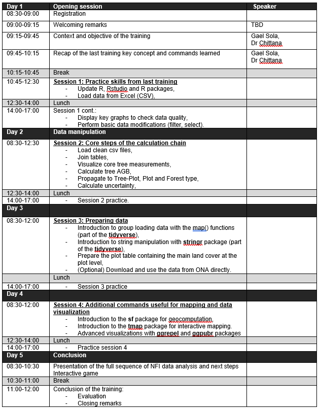

# training_R_laoPDR-202112

Repo for the second R training on Forest data analysis with R

## Background 

Lao PDR conducted three National Forest Inventories (NFI) and used the tree measurements from cycle 3 to calculate forest carbon stocks and Emission and Removal Factors for REDD+ reporting. JICA has been the main provider of technical backstopping to the country on REDD+ and developed capacities of Lao PDR Forest Inventory and Planning Department (FIPD) to implement NFI and report REDD+ emissions and removals. While implementation and reporting were carried out by FIPD, the data analysis part was outsourced due to the more advanced capacities required on programming and statistics. The analysis was performed with the R statistical software, an application using the R programming language to perform statistics and data analysis. 
As part of its technical support to Lao PDR, the CBIT-Forest project’s aim to add to JICA’s efforts to increase the sustainability of the country’s National Forest Monitoring. To do so, the project sets to improve the capacity of Lao PDR Forest Inventory and Planning Division (FIPD) to carry out statistical data analysis of its National Forest Inventory.
A first training was conducted in March 2021 and during this training FIPD participants had a first grasp of the capabilities of R for Forest data analysis and practiced simple commands to read data, make minor modifications and visualize it with simple graphs. A follow-up training was needed to start using more complex chain of commands to calculate tree level aboveground biomass and aggregate it to tree plot, forest plots and finally nationwide averages for key forest categories.

## Objective

The overall objective of this activity is to strengthen FIPD data analysis capacity through R trainings.
The specific objective of the training is to explain and practice all the steps and commands necessary for analyzing live tree data from NFI cycle 3 and calculate tree aboveground biomass at forest type level with their 90% uncertainty. 
This objective encompasses few steps in the full chain of calculations that also includes dead wood biomass and other calculations. In parallel to the training and with the support of JICA, the main original calculation script will be split into pre-identified calculation steps for an easy integration of the training results with the complete set of NFI data calculations.

## Requirements

This training is a follow-up training to the R course provided in March and the same participants are expected to attend. 
The participants will need to have at least one fairly recent computer for 2-3 persons (Windows 7/8/10 or equivalent) with R and Rstudio installed (instructions will be sent one week before the training starting date).

## Agenda

